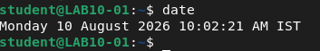
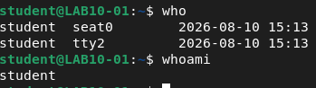
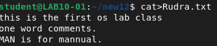
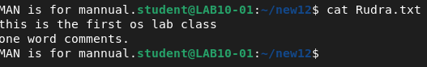
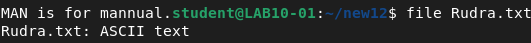
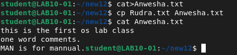
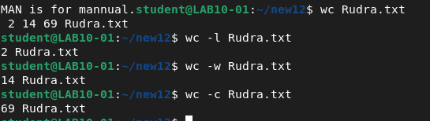
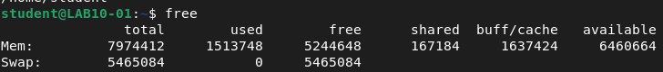
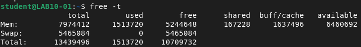

# Assignment 1 — Basic Linux Commands

**Institute of Engineering and Management**
**Operating Systems Lab (BCACC 392)**

**Name:** Arnab De | **Roll No.:** 63 | **Section:** A | **Year:** 2nd

---

## 1. Check today's date

**Command:**
```bash
date
```
**About:** The `date` command is used to display or set the system date and time in an operating system.

**Output:**
```
Monday 10 August 2026 10:02:21 AM IST
```



---

## 2. Display the calendar for this month

**Command:**
```bash
cal
```
**About:** The `cal` command displays the current month with today's date highlighted.

> ⚠️ No screenshot available for this one in the backup — run `cal` and add the output/screenshot here.

---

## 3. Find out the information of the current user

**Commands:**
```bash
who
whoami
```
**About:** `who` shows who is currently logged into the system (username, terminal, login time). `whoami` prints just the username of the current user running the shell.

**Output:**
```
student  seat0   2026-08-10 15:13
student  tty2    2026-08-10 15:13

student
```



---

## 4. Find out which directory currently you are in

**Command:**
```bash
pwd
```
**About:** The `pwd` command displays the current working directory (Print Working Directory).

**Output:**
```
/home/student
```


---

## 5. Create a directory

**Command:**
```bash
mkdir new12
```
**About:** The `mkdir` command is used to create a new directory (folder).

**Output:** No output on success — the directory is created silently.


---

## 6. Change the current directory to the created directory; check the current path

**Commands:**
```bash
cd new12
pwd
```
**About:** `cd` changes the current working directory. The prompt itself changes to `~/new12$`, confirming the path has switched. `pwd` then confirms the new path.

**Output:**
```
/home/student/new12
```


---

## 7. Create a simple text file, write something about yourself, and save it

**Command:**
```bash
cat > Rudra.txt
```
**About:** `cat > file_name` creates a new file (or replaces an old file with the same name), then reads input from the terminal until `Ctrl+D` is pressed.

**Input:**
```
this is the first os lab class
one word comments.
MAN is for mannual.
```
(followed by `Ctrl+D`)

**Output:** File `Rudra.txt` is created and saved with the above content, silently.



---

## 8. Display the contents of the above file

**Command:**
```bash
cat Rudra.txt
```
**About:** `cat` displays (prints) the full contents of a file. The command stands for "concatenate".

**Output:**
```
this is the first os lab class
one word comments.
MAN is for mannual.
```



---

## 9. Check the file type of the above created file

**Command:**
```bash
file Rudra.txt
```
**About:** The `file` command determines a file's type (such as ASCII text) by inspecting its internal data structure.

**Output:**
```
Rudra.txt: ASCII text
```



---

## 10. Create a file, write content inside it, and copy that content into another file

**Commands:**
```bash
cat > Anwesha.txt
cp Rudra.txt Anwesha.txt
cat Anwesha.txt
```
**About:** `cp source destination` copies content from a source file into a destination file, overwriting the destination's existing content.

**Output:**
```
this is the first os lab class
one word comments.
MAN is for mannual.
```



---

## 11. Show how many lines are there in your created file

**Command:**
```bash
wc -l Rudra.txt
```
**About:** `wc -l` counts the total number of lines in a file (`wc` stands for "word count").

**Output:**
```
2 Rudra.txt
```

*(see combined screenshot under Q12 below)*

---

## 12. Count the number of lines, words and characters in your file

**Commands:**
```bash
wc Rudra.txt
wc -l Rudra.txt
wc -w Rudra.txt
wc -c Rudra.txt
```
**About:** `wc` (no flags) prints lines, words, and characters together. `-l` isolates line count, `-w` isolates word count, `-c` isolates character (byte) count.

**Output:**
```
2 14 69 Rudra.txt

2 Rudra.txt        (lines)
14 Rudra.txt        (words)
69 Rudra.txt        (characters)
```



---

## 13. Display first few lines from your text file

**Command:**
```bash
head -1 Rudra.txt
```
**About:** `head` reads the first few lines of a text file and writes them to standard output. `head -1` outputs just the first line.

**Output:**
```
this is the first os lab class
```


---

## 14. Display last few lines from your text file

**Command:**
```bash
tail -1 Rudra.txt
```
**About:** `tail` reads the last few lines of a text file. `tail -1` displays exactly the last line of a file.

**Output:**
```
MAN is for mannual.
```


---

## 15. Check how much free disk space you have

**Command:**
```bash
free
```
**About:** The `free` command displays the total amount of free and used physical (RAM) and swap memory in the system, in kilobytes.

**Output:**
```
              total      used      free    shared  buff/cache   available
Mem:        7974412   1513748   5244648    167184     1637424     6460664
Swap:       5465084         0   5465084
```



---

## 16. Find out information about disk space

**Command:**
```bash
free -t
```
**About:** `free -t` displays the total amount of free and used physical memory (RAM) and swap space, adding a "total" summary line at the bottom of the output.

**Output:**
```
              total      used      free    shared  buff/cache   available
Mem:        7974412   1513720   5244648    167228     1637496     6460692
Swap:       5465084         0   5465084
Total:     13439496   1513720  10709732
```



---

## 17. Clear whatever you have written so far

**Command:**
```bash
clear
```
**About:** The `clear` command clears the terminal screen and its scrollback buffer, providing a clean state for further work.

**Output:** (Terminal screen is cleared)

> ⚠️ No screenshot available for this one in the backup — run `clear` and add a screenshot here if required.
