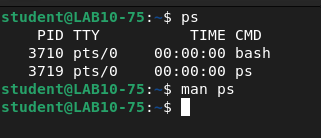
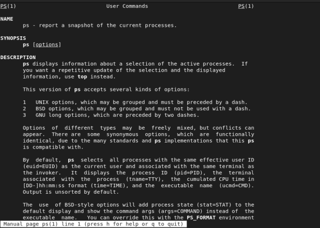
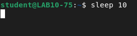
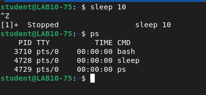
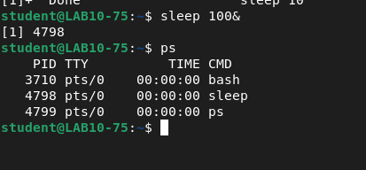
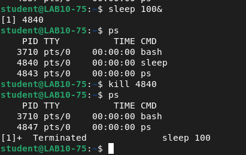
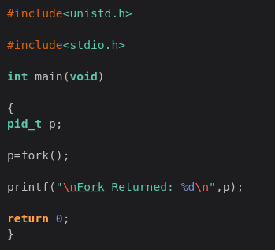
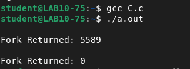

# Assignment 3 — Process Management

**Institute of Engineering and Management**
**Operating Systems Lab (BCACC 392)**

**Name:** Arnab De | **Roll No.:** 63 | **Section:** A | **Year:** 2nd

---

## 1. Display the current process ID

**Command:**
```bash
ps
man ps
```
**About:** `ps` reports a snapshot of the current processes attached to the terminal — showing each process's PID, TTY, cumulated CPU time, and command name. Here it shows the PID of the running shell (`bash`) and of the `ps` command itself. `man ps` pulls up the manual page describing what the command does and its options.

**Output:**
```
    PID TTY          TIME CMD
   3710 pts/0    00:00:00 bash
   3719 pts/0    00:00:00 ps
```




---

## 2. Use the sleep command to make your terminal idle for 10 seconds

**Command:**
```bash
sleep 10
```
**About:** `sleep 10` blocks the terminal for 10 seconds, doing nothing — a foreground idle process. To prove the process actually exists while idling, `Ctrl+Z` was used to suspend it mid-sleep, which drops it into the background as a **stopped** job; `ps` then shows it listed as a real process.

**Output:**
```
sleep 10
^Z
[1]+  Stopped                 sleep 10

    PID TTY          TIME CMD
   3710 pts/0    00:00:00 bash
   4728 pts/0    00:00:00 sleep
   4729 pts/0    00:00:00 ps
```




---

## 3. Create a sleep process for 100 sec as a background process

**Command:**
```bash
sleep 100&
```
**About:** Appending `&` runs the command in the **background**, immediately returning control of the terminal while the process keeps running. The shell prints the job number and PID (`[1] 4798`), and `ps` confirms the `sleep` process is active alongside `bash`.

**Output:**
```
sleep 100&
[1] 4798

    PID TTY          TIME CMD
   3710 pts/0    00:00:00 bash
   4798 pts/0    00:00:00 sleep
   4799 pts/0    00:00:00 ps
```



---

## 4. Kill the sleep process you have just created using its PID

**Command:**
```bash
sleep 100&
ps
kill 4840
ps
```
**About:** A fresh background `sleep 100&` is started (PID `4840`), confirmed via `ps`. `kill <PID>` sends the default `SIGTERM` signal to that process, asking it to terminate. Running `ps` again shows the sleep process is gone, and the shell reports the job as `Terminated`.

**Output:**
```
sleep 100&
[1] 4840

    PID TTY          TIME CMD
   3710 pts/0    00:00:00 bash
   4840 pts/0    00:00:00 sleep
   4843 pts/0    00:00:00 ps

kill 4840

    PID TTY          TIME CMD
   3710 pts/0    00:00:00 bash
   4847 pts/0    00:00:00 ps

[1]+  Terminated              sleep 100
```



---

## 5. Write a C program to create a process using fork() and display the Process IDs

**Commands:**
```bash
gnome-text-editor C.c
gcc C.c
./a.out
```
**About:** `fork()` creates a new process (the **child**) as a duplicate of the calling process (the **parent**). It returns twice — once in each process — with different return values: in the **parent**, it returns the child's PID (a positive number); in the **child**, it returns `0`. That's why a single `printf` call ends up printing two different values, once per process.

**Code (`C.c`):**
```c
#include<unistd.h>
#include<stdio.h>

int main(void)
{
    pid_t p;

    p = fork();

    printf("\nFork Returned: %d\n", p);

    return 0;
}
```

**Output:**
```
Fork Returned: 5589
Fork Returned: 0
```





---

## 6. Write a C program to show the orphan process concept

**About:** An **orphan process** is a child process whose parent has terminated (or exited) before it. When that happens, the child is "adopted" by `init`/PID 1 (or the nearest surviving ancestor, depending on the system), which becomes its new parent — visible via `getppid()` returning a different value than before. Here, the parent process sleeps for 5 seconds and exits, while the child loops forever, printing its own PID and its parent's PID once per second — after the original parent exits, the printed parent PID changes.

**Code:**
```c
#include<stdio.h>
#include<unistd.h>

int main(void)
{
    pid_t pid;
    pid = fork();

    if (pid != 0)
    {
        sleep(5);
        exit(0);
    }
    else if (pid == 0)
    {
        for (;;)
        {
            sleep(1);
            printf("PROCESS ID: %d PARENT PROCESS ID: %d\n",
                   getpid(), getppid());
        }
    }
    return 0;
}
```

> Note: the version copied from the notebook has a stray semicolon after `else if(pid==0);`, which would make that branch an empty statement followed by an unconditional block — the version above removes it so the code behaves as intended (only the child runs the infinite loop). No run/output screenshot was available for this one — worth compiling and running it to capture the PID change once the parent exits.
