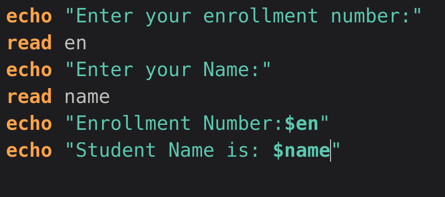
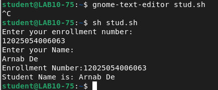
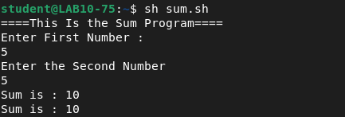
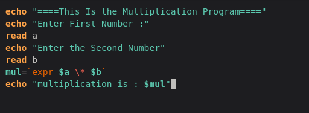
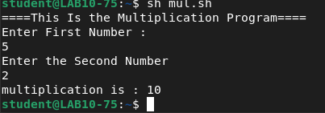
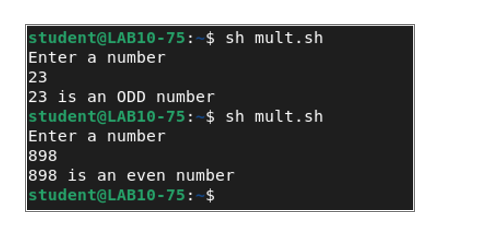

# Assignment 4 — Shell Scripting: Input, Arithmetic & Conditionals

**Institute of Engineering and Management**
**Operating Systems Lab (BCACC 392)**

**Name:** Arnab De | **Roll No.:** 63 | **Section:** A | **Year:** 2nd

---

## 1. Take the following inputs from the student and display the contents (Enrollment Number, Name)

**Commands:**
```bash
gnome-text-editor stud.sh
sh stud.sh
```
**About:** `gnome-text-editor` is used to write the shell script `stud.sh`. `echo` prints a prompt to the screen, and `read` captures the user's input into a variable. The script then echoes those variables back using `$variable_name` substitution.

**Script (`stud.sh`):**
```bash
echo "Enter your enrollment number:"
read en
echo "Enter your Name:"
read name
echo "Enrollment Number:$en"
echo "Student Name is: $name"
```

**Output:**
```
Enter your enrollment number:
12025054006063
Enter your Name:
Arnab De
Enrollment Number:12025054006063
Student Name is: Arnab De
```




---

## 2. Take two numbers as input, store in variables "a" and "b", and calculate the sum (Sum = a + b, display Sum)

**Commands:**
```bash
gnome-text-editor sum.sh
sh sum.sh
```
**About:** Same `read`/`echo` pattern as above, using backtick command substitution with `expr` to perform the arithmetic (shell variables are treated as strings by default, so `expr` is needed to evaluate the sum).

**Script (`sum.sh`):**
```bash
echo "====This Is the Sum Program===="
echo "Enter First Number :"
read a
echo "Enter the Second Number"
read b
sum=`expr $a + $b`
echo "Sum is : $sum"
```

**Output:**
```
====This Is the Sum Program====
Enter First Number :
5
Enter the Second Number
5
Sum is : 10
```




---

## 3. Take a two-digit number and a three-digit number, store in "a" and "b", and multiply them (Multiply = a * b, display the answer)

**Commands:**
```bash
gnome-text-editor mul.sh
sh mul.sh
```
**About:** Same structure as the sum script, but uses `expr $a \* $b` — the asterisk is escaped with `\` so the shell doesn't interpret it as a wildcard for filename expansion.

**Script (`mul.sh`):**
```bash
echo "====This Is the Multiplication Program===="
echo "Enter First Number :"
read a
echo "Enter the Second Number"
read b
mul=`expr $a \* $b`
echo "multiplication is : $mul"
```

**Output:**
```
====This Is the Multiplication Program====
Enter First Number :
5
Enter the Second Number
2
multiplication is : 10
```





> Note: the question calls for a two-digit and a three-digit number specifically (e.g. `42` and `137`), but the recorded run used `5` and `2` to demonstrate the script logic. Re-running with digit counts matching the question would make this a more exact match.

---

## 4. Take a number as input and check whether it is even or odd

**Commands:**
```bash
gnome-text-editor mult.sh
sh mult.sh
```
**About:** Shell arithmetic conditionals use `expr` with the modulus operator (`%`) to check divisibility by 2, inside an `if`/`else` block. `-eq 0` tests whether the remainder equals zero.

**Script (`mult.sh`):**
```bash
echo "Enter a number"
read n
rem=`expr $n % 2`
if [ $rem -eq 0 ]
then
    echo "$n is an even number"
else
    echo "$n is an ODD number"
fi
```
> Note: only the run/output was available, not the actual script source — the version above is reconstructed to match the exact output text, including the ODD/even capitalization difference seen in your run. Worth confirming it matches your real `mult.sh`.

**Output:**
```
Enter a number
23
23 is an ODD number

Enter a number
898
898 is an even number
```


