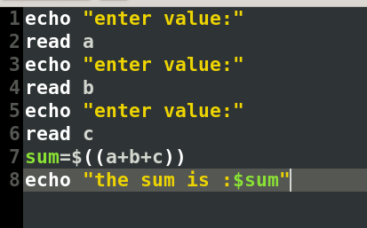
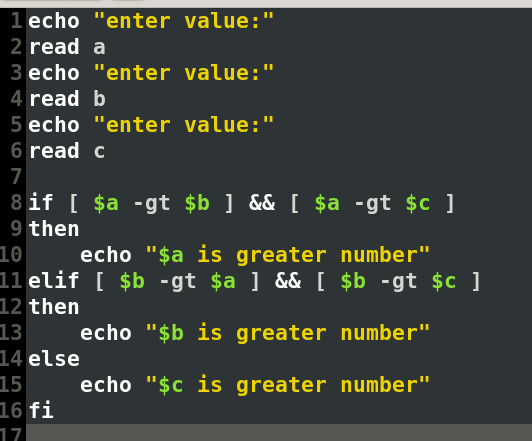
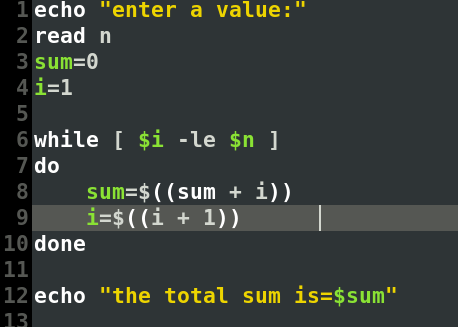
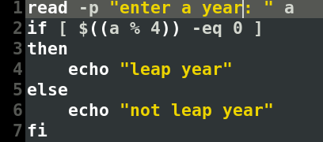

# Assignment 5 — Shell Scripting: Loops & Conditionals

**Institute of Engineering and Management**
**Operating Systems Lab (BCACC 392)**

**Name:** Arnab De | **Roll No.:** 63 | **Section:** A | **Year:** 2nd

---

## 1. Take three numbers as input from the user, add all the numbers, and print the sum

**About:** `read` captures each input into a variable. `$((a+b+c))` is shell arithmetic expansion — it evaluates the sum of the three variables without needing an external tool like `expr`.

**Script:**
```bash
echo "enter value:"
read a
echo "enter value:"
read b
echo "enter value:"
read c
sum=$((a+b+c))
echo "the sum is :$sum"
```

**Output:**
```
enter value:
5
enter value:
10
enter value:
15
the sum is :30
```



---

## 2. Take three numbers as input and find the greatest number among the three

**About:** Each input is compared pairwise using `-gt` (greater than) inside `if`/`elif`/`else`. The `&&` combines two conditions — a number is only printed as the greatest if it's larger than *both* of the other two.

**Script:**
```bash
echo "enter value:"
read a
echo "enter value:"
read b
echo "enter value:"
read c

if [ $a -gt $b ] && [ $a -gt $c ]
then
    echo "$a is greater number"
elif [ $b -gt $a ] && [ $b -gt $c ]
then
    echo "$b is greater number"
else
    echo "$c is greater number"
fi
```

**Output:**
```
enter value:
7
enter value:
22
enter value:
13
22 is greater number
```



---

## 3. Calculate the sum of the series 1 + 2 + 3 + ... + N

**About:** A `while` loop runs as long as the counter `i` is less than or equal to `n` (`-le`). Each iteration adds `i` to the running total `sum` and increments `i`, using arithmetic expansion `$((...))` for both.

**Script:**
```bash
echo "enter a value:"
read n
sum=0
i=1

while [ $i -le $n ]
do
    sum=$((sum + i))
    i=$((i + 1))
done

echo "the total sum is=$sum"
```

**Output:**
```
enter a value:
5
the total sum is=15
```



---

## 4. Check whether an entered year is a leap year or not

**About:** `read -p "prompt"` combines the prompt and the read into one line instead of two separate `echo`/`read` commands. The script checks divisibility by 4 using the modulus operator (`% 4`) — note this is a simplified leap-year check that doesn't account for the century-year exception (divisible by 100 but not 400).

**Script:**
```bash
read -p "enter a year: " a
if [ $((a % 4)) -eq 0 ]
then
    echo "leap year"
else
    echo "not leap year"
fi
```

**Output:**
```
enter a year: 2024
leap year

enter a year: 2023
not leap year
```



> Note: only editor/code screenshots were available for this assignment, not terminal run screenshots — the outputs above are transcribed from the typed lab report, which matches the code shown.
