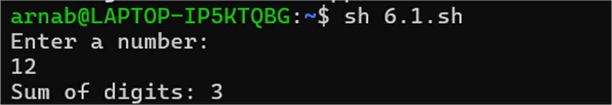
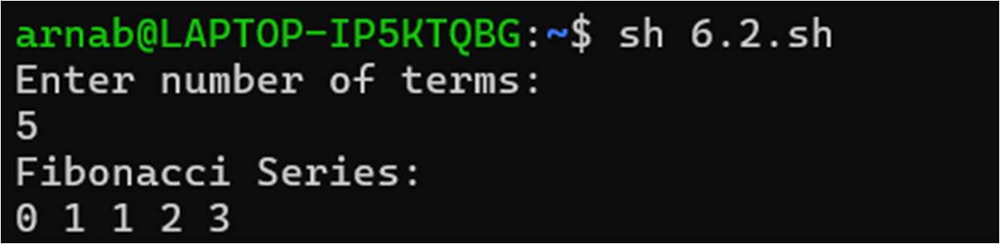
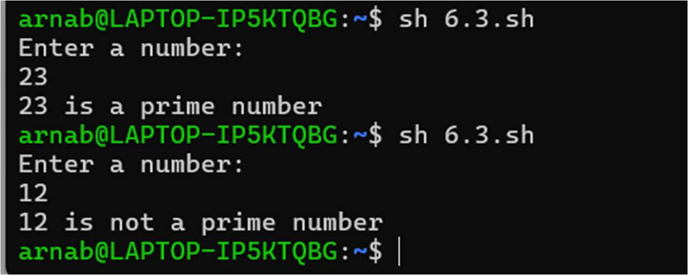
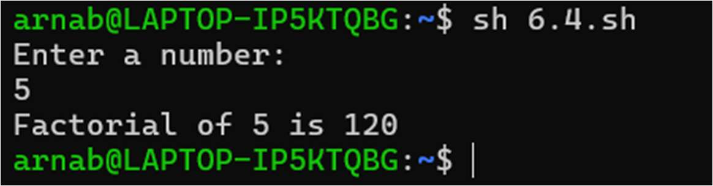
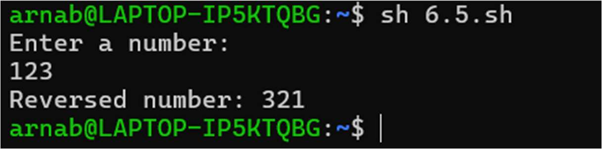

# Assignment 6 — Shell Scripting (Loops & Conditionals)

Operating Systems Lab | Arnab De

Each script uses `read`, `while`, `expr`, and `if` constructs to solve a classic
numeric problem in Bourne shell (`sh`).

---

## 6.1 — Sum of Digits

Reads a number and repeatedly extracts the last digit with `% 10`, adding it to
a running total, then removes that digit with integer division `/ 10` until
the number reaches 0.

```sh
echo "Enter a number:"
read n
sum=0
while [ $n -gt 0 ]
do
    digit=`expr $n % 10`
    sum=`expr $sum + $digit`
    n=`expr $n / 10`
done
echo "Sum of digits: $sum"
```

**Output**



---

## 6.2 — Fibonacci Series

Prints the first `n` terms of the Fibonacci sequence by keeping two running
values (`a`, `b`) and advancing them each iteration.

```sh
echo "Enter number of terms:"
read n
a=0
b=1
i=0
echo "Fibonacci Series:"
while [ $i -lt $n ]
do
    echo -n "$a "
    fn=`expr $a + $b`
    a=$b
    b=$fn
    i=`expr $i + 1`
done
echo
```

**Output**



---

## 6.3 — Prime Number Check

Tests divisibility by every integer from 2 up to `n/2`. A `flag` is dropped to
0 as soon as a divisor is found, and the loop condition checks the flag so it
exits early once the number is known to be composite.

```sh
echo "Enter a number:"
read n
flag=1
i=2
while [ $i -le `expr $n / 2` ] && [ $flag -eq 1 ]
do
    if [ `expr $n % $i` -eq 0 ]
    then
        flag=0
    fi
    i=`expr $i + 1`
done
if [ $n -gt 1 ] && [ $flag -eq 1 ]
then
    echo "$n is a prime number"
else
    echo "$n is not a prime number"
fi
```

**Output**



---

## 6.4 — Factorial

Multiplies `fact` by every integer from 1 to `n`.

```sh
echo "Enter a number:"
read n
fact=1
i=1
while [ $i -le $n ]
do
    fact=`expr $fact \* $i`
    i=`expr $i + 1`
done
echo "Factorial of $n is $fact"
```

**Output**



---

## 6.5 — Reverse a Number

Builds the reversed number digit by digit: each extracted digit is shifted
into `rev` (`rev * 10 + digit`) while `n` is stripped down via `/ 10`.

```sh
echo "Enter a number:"
read n
rev=0
while [ $n -gt 0 ]
do
    digit=`expr $n % 10`
    rev=`expr $rev \* 10 + $digit`
    n=`expr $n / 10`
done
echo "Reversed number: $rev"
```

**Output**



---

### How to run
```sh
chmod +x 6.*.sh
sh 6.1.sh   # or ./6.1.sh
```
