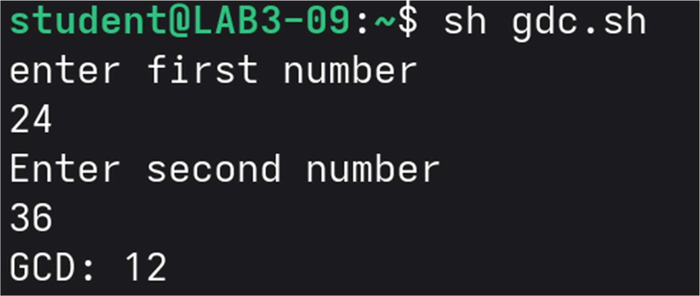
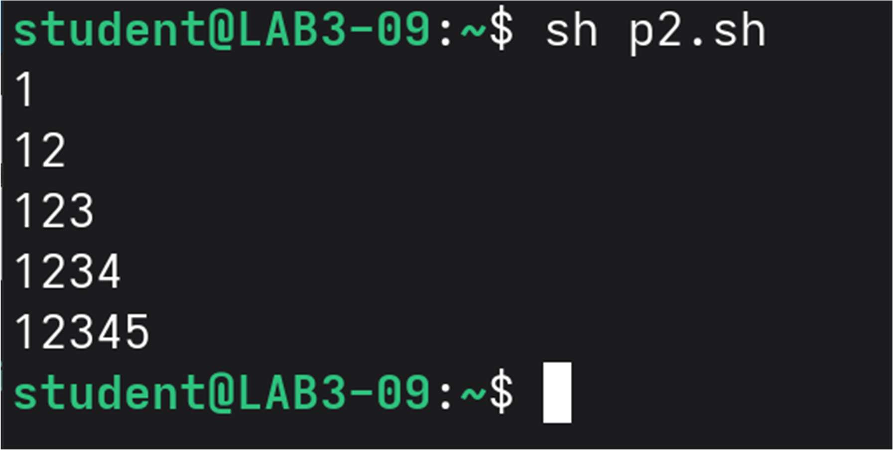
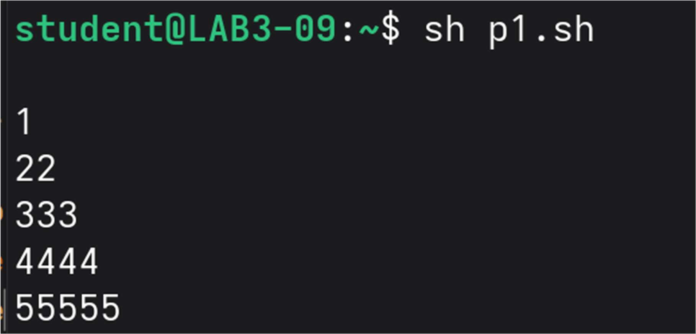
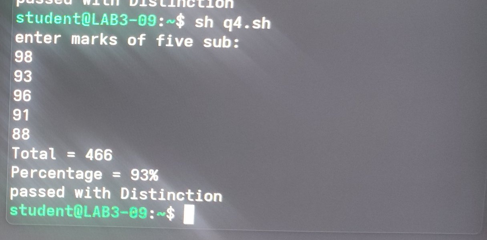

# Assignment 7 — Shell Scripting (Loops, Case & Menu-Driven Programs)

Operating Systems Lab | Arnab De

Each script uses `read`, `while`/`for`, `expr`, `if`, and `case` constructs to
solve a classic shell-scripting problem in Bourne shell (`sh`).

---

## 7.1 — GCD of Two Numbers

Reads two numbers and repeatedly applies the Euclidean algorithm — replacing
the pair `(a, b)` with `(b, a % b)` — until the remainder reaches 0. The
non-zero value left in `a` is the GCD.

```sh
echo "Enter first number"
read a
echo "Enter second number"
read b
while [ $b -ne 0 ]
do
    r=`expr $a % $b`
    a=$b
    b=$r
done
echo "GCD: $a"
```

**Output**



---

## 7.2 — Pattern: 1, 12, 123, 1234, 12345

A nested `for` loop where the inner loop prints `1` through the current
outer index `i` on each row, building up one digit at a time.

```sh
n=5
for (( i=1; i<=n; i++ ))
do
    for (( j=1; j<=i; j++ ))
    do
        echo -n "$j"
    done
    echo
done
```

**Output**



---

## 7.3 — Pattern: 1, 22, 333, 4444, 55555

A nested `while` loop where the inner loop prints the outer index `i`
repeated `i` times, instead of counting up like in 7.2.

```sh
i=1
while [ $i -le 5 ]
do
    j=1
    while [ $j -le $i ]
    do
        echo -n "$i"
        j=`expr $j + 1`
    done
    echo
    i=`expr $i + 1`
done
```

**Output**



---

## 7.4 — Calculator (+, -, \*, /)

Reads two numbers and a menu choice, then uses a `case` statement to route
to the right `expr` operation. Division guards against a zero divisor before
computing. Note that `*` has to be escaped (`\*`) inside backtick `expr` —
otherwise the shell expands it as a filename glob before `expr` ever sees it.

```sh
echo "Enter first number"
read n1
echo "Enter second number"
read n2

echo "Press 1 to add:"
echo "Press 2 subtract"
echo "Press 3 for multiply "
echo "Press 4 for divide"
echo "Enter your choice"
read a

case $a in
 1)
    echo "Addition = `expr $n1 + $n2`"
 ;;
 2)
    echo "Subtraction = `expr $n1 - $n2`"
 ;;
 3)
    echo "Multiply = `expr $n1 \* $n2`"
 ;;
 4)
    if [ $n2 -eq 0 ]
    then
        echo "Division by zero is not possible"
    else
        echo "Division= `expr $n1 / $n2`"
    fi
 ;;
 *)
    echo "Invalid choice"
 ;;
esac
```

**Output**

_No terminal screenshot captured yet for the corrected version — swap in a
real one from `sh 7.4.sh` once you re-run it on the lab machine. Expected
run:_

```
student@LAB3-09:~$ sh 7.4.sh
Enter first number
12
Enter second number
25
Press 1 to add:
Press 2 subtract
Press 3 for multiply
Press 4 for divide
Enter your choice
3
Multiply = 300
```

---

## 7.5 — Mark Sheet Generator

Reads marks for five subjects, sums them with `expr`, and derives a
percentage out of 500. An `if`/`elif` chain using `-ge` (not `-gt`, so the
60/50/40 boundaries themselves count as passing) decides the class.

```sh
echo "enter marks of five sub:"
read a
read b
read c
read d
read e

total=`expr $a + $b + $c + $d + $e`
per=`expr $total / 5`

echo "Total = $total"
echo "Percentage = $per%"

if test $per -ge 60
then
    echo "passed with Distinction"
elif test $per -ge 50
then
    echo "passed with second class"
elif test $per -ge 40
then
    echo "passed with third class"
else
    echo "failed"
fi
```

**Output**



---

## 7.6 — ATM System (Check Balance, Deposit, Withdrawal)

A menu-driven `case` inside a `while true` loop so the user can perform
multiple transactions before exiting. Withdrawal is guarded against
overdrawing the balance.

```sh
balance=5000

while true
do
    echo "-------- ATM MENU --------"
    echo "Press 1 to check balance"
    echo "Press 2 to deposit"
    echo "Press 3 to withdraw"
    echo "Press 4 to exit"
    echo "Enter your choice"
    read choice

    case $choice in
     1)
        echo "Your balance is: $balance"
     ;;
     2)
        echo "Enter amount to deposit"
        read amt
        balance=`expr $balance + $amt`
        echo "Deposit successful. New balance: $balance"
     ;;
     3)
        echo "Enter amount to withdraw"
        read amt
        if [ $amt -gt $balance ]
        then
            echo "Insufficient balance"
        else
            balance=`expr $balance - $amt`
            echo "Withdrawal successful. New balance: $balance"
        fi
     ;;
     4)
        echo "Thank you for using the ATM"
        break
     ;;
     *)
        echo "Invalid choice"
     ;;
    esac
    echo ""
done
```

**Output**

_No terminal screenshot captured yet for the corrected version — an earlier
draft had the deposit/withdraw branches mixed up. Swap in a real one from
`sh 7.6.sh` once you re-run it on the lab machine. Expected run:_

```
student@LAB3-09:~$ sh 7.6.sh
-------- ATM MENU --------
Press 1 to check balance
Press 2 to deposit
Press 3 to withdraw
Press 4 to exit
Enter your choice
1
Your balance is: 5000

-------- ATM MENU --------
Press 1 to check balance
Press 2 to deposit
Press 3 to withdraw
Press 4 to exit
Enter your choice
2
Enter amount to deposit
200
Deposit successful. New balance: 5200

-------- ATM MENU --------
Press 1 to check balance
Press 2 to deposit
Press 3 to withdraw
Press 4 to exit
Enter your choice
3
Enter amount to withdraw
500
Withdrawal successful. New balance: 4700

-------- ATM MENU --------
Press 1 to check balance
Press 2 to deposit
Press 3 to withdraw
Press 4 to exit
Enter your choice
4
Thank you for using the ATM
student@LAB3-09:~$
```

---

### How to run
```sh
chmod +x 7.*.sh
sh 7.1.sh   # or ./7.1.sh
```
