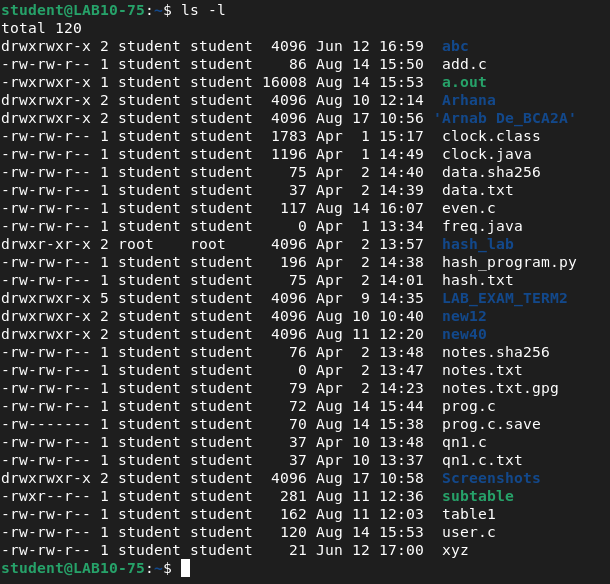
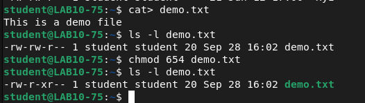
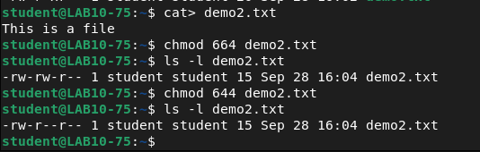
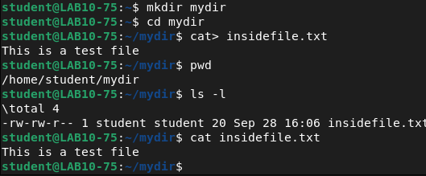
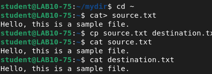
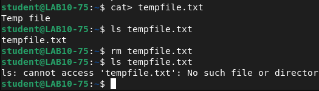
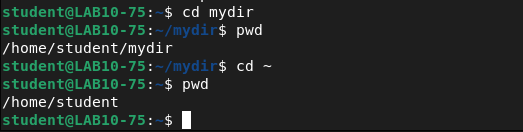
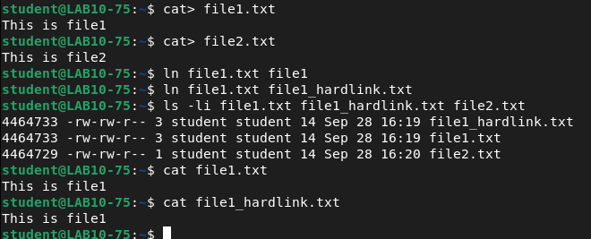
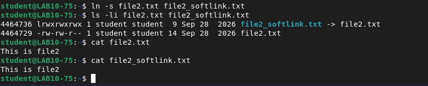

# Assignment 8 — Linux File & Directory Commands

Institute of Engineering and Management | Operating Systems Lab (BCACC 392)

Name: Arnab De

---

## 1. Check current working directory

```
pwd
```
`pwd` (print working directory) shows the full path of the directory you are currently in.

**Output**


---

## 2. List all files with their permissions

```
ls -l
```
`-l` gives the long listing format: permissions, links, owner, group, size, date and name.

**Output**



---

## 3. Give execute permission to group using octal

```
cat > demo.txt
This is a demo file
^D

ls -l demo.txt
chmod 654 demo.txt
ls -l demo.txt
```
The file starts as `rw-rw-r--` (664). `chmod 654` sets it to `rw-r-xr--`: the group digit becomes 5 (r-x), so the group now has execute permission.

**Output**



---

## 4. Take away write permission from group

```
cat > demo2.txt
This is a file
^D

chmod 664 demo2.txt
ls -l demo2.txt
chmod 644 demo2.txt
ls -l demo2.txt
```
664 (`rw-rw-r--`) gives the group write access. `chmod 644` changes the group digit from 6 to 4, giving `rw-r--r--` and removing group write.

**Output**



---

## 5. Make a directory, change path, save a file inside it

```
mkdir mydir
cd mydir
cat > insidefile.txt
This is a test file
^D

pwd
ls -l
cat insidefile.txt
```
`mkdir` creates the directory, `cd` moves into it, and the file created afterwards is saved inside it.

**Output**



---

## 6. Copy the content of a file into another file

```
cd ~
cat > source.txt
Hello, this is a sample file.
^D

cp source.txt destination.txt
cat source.txt
cat destination.txt
```
`cp` copies `source.txt` into `destination.txt`; `cat` on both shows identical content.

**Output**



---

## 7. Delete a file and check if the file exists

```
cat > tempfile.txt
Temp file
^D

ls tempfile.txt
rm tempfile.txt
ls tempfile.txt
```
`rm` deletes the file. The last `ls` reports "No such file or directory", confirming it no longer exists.

**Output**



---

## 8. Return to the initial home directory

```
cd mydir
pwd
cd ~
pwd
```
`cd ~` returns to the home directory (`/home/student`) from anywhere.

**Output**



---

## 9. Hard link between two files, check inode numbers and content

```
cat > file1.txt
This is file1
^D

cat > file2.txt
This is file2
^D

ln file1.txt file1
ln file1.txt file1_hardlink.txt
ls -li file1.txt file1_hardlink.txt file2.txt
cat file1.txt
cat file1_hardlink.txt
```
A hard link is another name for the same file, so `file1.txt` and `file1_hardlink.txt` show the same inode number (4464733) and the same content. The link count of 3 comes from the two hard links made with `ln`. `file2.txt` has a different inode (4464729).

**Output**



---

## 10. Soft link between the two files, check inode numbers and content

```
ln -s file2.txt file2_softlink.txt
ls -li file2.txt file2_softlink.txt
cat file2.txt
cat file2_softlink.txt
```
A soft (symbolic) link is a separate file that points to the original path, so it gets a different inode number (4464736 vs 4464729) and `ls -li` shows `file2_softlink.txt -> file2.txt`. Reading it with `cat` displays the original file's content.

**Output**


