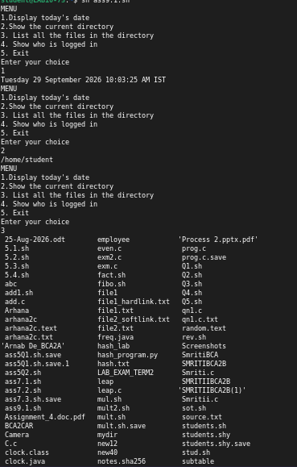
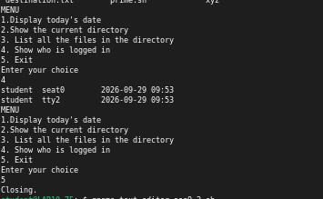
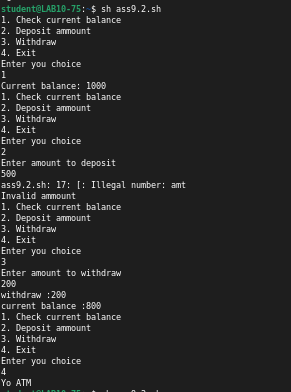
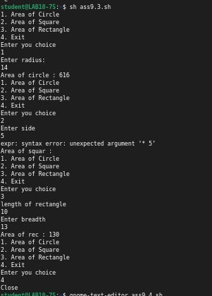
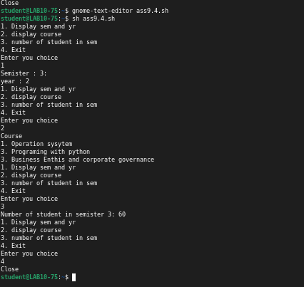

# Assignment 9 — Menu-Driven Shell Scripts

Institute of Engineering and Management | Operating Systems Lab (BCACC 392)

Name: Arnab De

---

## 1. Menu-driven script: date, directory, file listing, logged-in users

```sh
while true
do
    echo "MENU"
    echo "1.Display today's date"
    echo "2.Show the current directory"
    echo "3. List all the files in the directory"
    echo "4. Show who is logged in"
    echo "5. Exit"
    echo "Enter your choice"
    read ch
    case $ch in
        1) date ;;
        2) pwd ;;
        3) ls ;;
        4) who ;;
        5) echo "Closing." ; break ;;
        6) echo "Invalid Choicee" ;;
    esac
done
```
`case` matches the option to the matching command. `read ch` takes the choice, and option 5 breaks out of the `while true` loop to end the script.

**Output**




---

## 2. Menu-driven ATM operations

```sh
balance=1000
while true
do
    echo "1. Check current balance"
    echo "2. Deposit ammount"
    echo "3. Withdraw"
    echo "4. Exit"
    echo "Enter you choice"
    read choice
    case $choice in
        1)
            echo "Current balance: $balance"
            ;;
        2)
            echo "Enter amount to deposit"
            read amt
            if [ amt -gt 0 ]
            then
                balance=`expr $balance + $amt`
                echo "Deposited $amt"
                echo "current balance : $balance"
            else
                echo "invalid ammount"
            fi
            ;;
        3)
            echo "Enter amount to withdraw"
            read amt
            if [ $amt -le 0 ]
            then
                echo "invalid"
            elif [ $amt -gt $balance ]
            then
                echo "insff"
            else
                balance=`expr $balance - $amt`
                echo "withdraw :$amt"
                echo "current balance :$balance"
            fi
            ;;
        4)
            echo "Yo ATM"
            break ;;
        *)
            echo "invalid choice"
            ;;
    esac
done
```
Starting balance is 1000. Deposit adds to `balance` with `expr`, withdraw checks for a non-positive amount and insufficient balance before subtracting.

**Known bug (visible in the output below):** the deposit branch has `if [ amt -gt 0 ]` — missing the `$` before `amt`. Bash tries to compare the literal word `amt` as a number and fails with `[: Illegal number: amt`, which the shell treats as a failed test, so it always falls into the `else` and prints "invalid ammount" even for a valid deposit like 500. The withdraw branch correctly uses `$amt` and works fine.
**Fix:** change `if [ amt -gt 0 ]` to `if [ $amt -gt 0 ]`.

**Output**



---

## 3. Menu-driven area calculator (circle, square, rectangle)

```sh
while true
do
    echo "1. Area of Circle"
    echo "2. Area of Square"
    echo "3. Area of Rectangle"
    echo "4. Exit"
    echo "Enter you choice"
    read choice
    case $choice in
        1)
            echo "Enter radius:"
            read r
            area=`expr 22 \* $r \* $r / 7`
            echo "Area of circle : $area"
            ;;
        2)
            echo "Enter side"
            read s
            area=`expr $s \* $s`
            echo "Area of squar : $area"
            ;;
        3)
            echo "length of rectangle"
            read l
            echo "Enter breadth"
            read b
            area=`expr $l \* $b`
            echo "Area of rec : $area"
            ;;
        4)
            echo "Close"
            break
            ;;
        *)
            echo "invalid choice"
            ;;
    esac
done
```
Circle area uses the integer approximation pi = 22/7 since `expr` only does integer math (radius 14 → 22×14×14/7 = 616, matches the output). Rectangle multiplies length by breadth.

**Known bug (visible in the output below):** the square branch fails at runtime with `expr: syntax error: unexpected argument '* 5'`, even though the line looks identical in structure to the working circle/rectangle lines. This is a real error from the actual run — if you hit it again, retype that line by hand (don't copy-paste) to rule out a hidden/invisible character before the `\*`, or replace it with arithmetic expansion instead of `expr`:
```sh
area=$((s * s))
```

**Output**



---

## 4. Menu-driven Student database

```sh
year=2
student=60
while true
do
    echo "1. Display sem and yr"
    echo "2. display course"
    echo "3. number of student in sem"
    echo "4. Exit"
    echo "Enter you choice"
    read choice
    case $choice in
        1)
            echo "Semister : $sem:"
            echo "year : $year"
            ;;
        2)
            echo "Course"
            echo "1. Operation sysytem"
            echo "3. Programing with python"
            echo "3. Business Enthis and corporate governance"
            ;;
        3)
            echo "Number of student in semister $sem: $student"
            ;;
        4)
            echo "Close"
            break
            ;;
        *)
            echo "Invalid choice"
            ;;
    esac
done
```
`year` and `student` are set at the top; the script displays them and a fixed course list on request.

**Known bug:** `$sem` is never assigned anywhere in this script (no `sem=` line, no `read sem`), yet the output below shows "Semister : 3:". That value is leaking in from a `sem` variable left over in the terminal session it was run in (from an earlier command), not from the script itself — running this script fresh in a new terminal will show `Semister : :` (empty). **Fix:** add `sem=3` near the top with `year` and `student`.

**Output**


